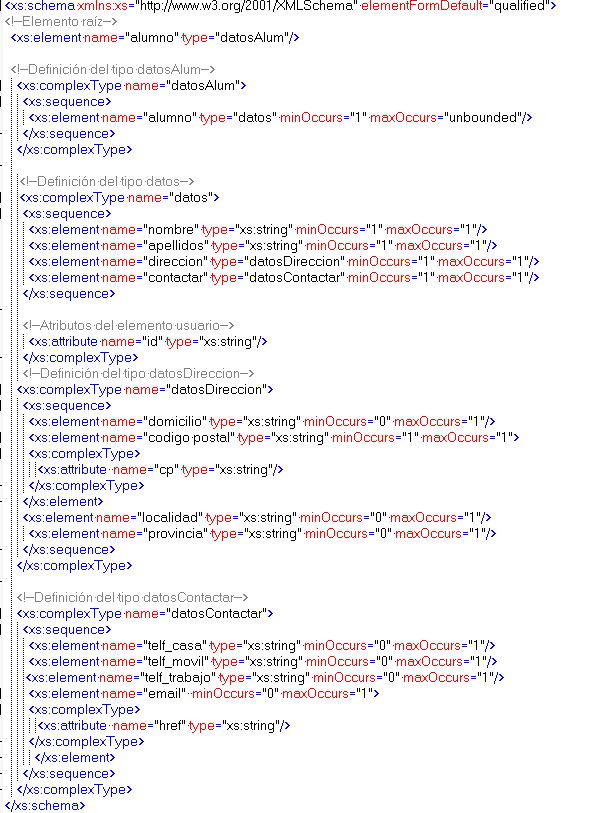

Algunos de los más usados son:

- Esquema, **xs:schema**, contiene la definición del esquema.
- Tipos complejos, **xs:complexType**, define tipos complejos.
- Tipos simples, **xs:simpleType**, permite definir un tipo simple restringiendo sus valores.
- Restricciones, **xs:restriction**, permite establecer una restricción sobre un elemento de tipo base.
- Agrupaciones, **xs:group**, permite nombrar agrupaciones de elementos y de atributos para hacer referencia a ellas.
- Secuencias, **xs:secuence**, permite construir elementos complejos mediante la enumeración de los que les forman.
- Alternativa, **xs:choice**, representa alternativas, hay que tener en cuenta que es una o‐exclusiva.
- Contenido mixto, definido dando valor true al atributo mixed del elemento **xs:complexType**, permite mezclar texto con elementos.
- Secuencias no ordenadas, **xs:all**, representa a todos los elementos en cualquier orden.

  **_Ejercicio resuelto:_** Esquema correspondiente a un documento XML para estructurar la información personal sobre alumnos.

