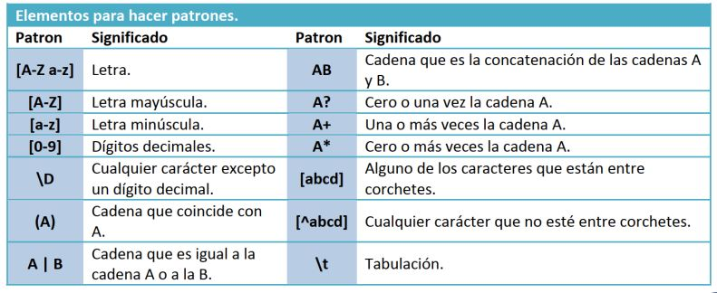

¿Cuáles son las restricciones que podemos aplicar sobre los valores de los datos de un elemento o atributo?

Están definidos por las facetas, que solo pueden aplicarse sobre tipos simples utilizando el elemento xs:restriction. Se expresan como un elemento dentro de una restricción y se pueden combinar para lograr restringir más el valor del elemento. Son, entre otros:

- **length, minLength, maxLentgh**: Longitud del tipo de datos.
- **enumeration**: Restringe a un determinado conjunto de valores.
  **_Ejercicio resuelto:_** Creación de una cadena de texto con una longitud máxima de 9 caracteres y dos valores posibles.

```xsd
<xs:simpleType name="estado">
    <xs:restriction base="xs:string">
    <xs:maxLength value="9"/>
    <xs:enumeration value="conectado"/>
    <xs:maxLength value="ocupado"/>
    </xs:restriction>
</xs:simpleType>
```

- **whitespace:** Define el tratamiento de espacios (preserve/replace, collapse).

  **_Ejercicio resuelto:_** Creación de un elemento en el que se respetan los espacios tal y como se han introducido

```xsd
<xs:simpleType name="nombre">
    <xs:restriction base="xs:string">
    <xs:whitespac value="preserve"/>
    </xs:restriction>
</xs:simpleType>
```

- **(max/min)(In/Ex)clusive:** Límites superiores/inferiores del tipo de datos. Cuando son Inclusive el valor que se determine es parte del conjunto de valores válidos para el dato, mientras que cuando se utiliza Exclusive, el valor dado no pertenece al conjunto de valores válidos.
- **totalDigits, fractionDigits:** número de dígitos totales y decimales de un número decimal.
  **_Ejercicio resuelto:_** Creación de un elemento calificaciones de dos dígitos cuyo valor es un número entero comprendido entre 1 y 10, ambos inclusive.

```xsd
<xs:simpleType name="calificaciones">
    <xs:restriction base="xs:integer">
    <xs:totalDigits value="2"/>
    <xs:minExclusive value="0"/>
    <xs:maxInclusive value="10"/>
    </xs:restriction>
</xs:simpleType>
```

- **pattern:** Permite construir máscaras que han de cumplir los datos de un elemento. La siguiente tabla muestra algunos de los caracteres que tienen un significado especial para la generación de las máscaras.



**_Ejercicio resuelto:_** El ejemplo siguiente muestra la utilización de pattern para crear la máscara de un DNI.

```xsd
<xs:simpleType name="dni">
    <xs:restriction base="xs:string">
    <xs:pattern value="[0-9] [0-9] [0-9] [0-9] [0-9] [0-9] [0-9] [0-9] [0-9] [A-z]"/>
    </xs:restriction>
</xs:simpleType>
```
